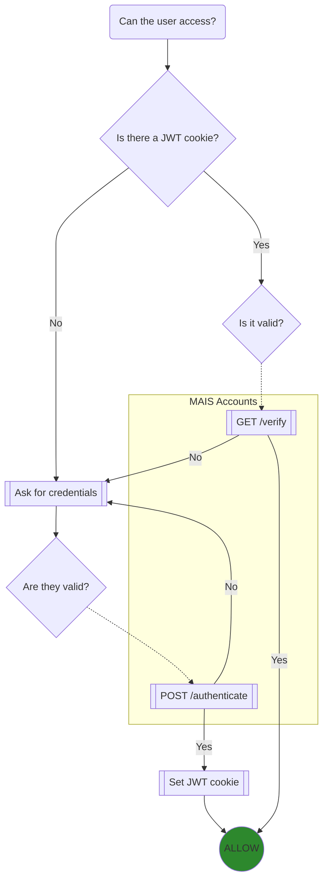

# MAIS Access

mais-access provides a simple yet secure HTTP/JWT authentication middleware for applications developed within the MAIS system. After initial connection, sessions for authenticated clients are validated by JSON Web Tokens for reduced overhead and improved security.

## How it works

At the core of MAIS Access is a Railtie (`lib/access.rb`). Upon load, it mutates `ApplicationController` by adding, among other helper methods, a `before_action` that either checks for a valid JSON Web Token (JWT) or requires HTTP Basic Authentication.

If there is a valid JWT cookie attached to the request, that token is sent to MAIS Accounts for verification. If successful, the user's information is parsed from it and passed along to the app.

If there isn't a valid JWT (it's either missing or expired), the user is prompted for their credentials. Those credentials are encrypted and sent to MAIS Accounts, which compares them against known users. If successful, the user is authenticated like above and a JWT cookie is passed back and written to the user's browser for future requests. If it's not successful, the user is prompted again.

In flowchart form:

## License

Copyright (c) 2023 [Elias Gabriel](https://eliasfgabriel.com/), [sdbase](http://sdbase.com/)

This work is licensed under the Creative Commons Attribution-NonCommercial-ShareAlike 4.0 International License.

To view a copy of this license, visit <http://creativecommons.org/licenses/by-nc-sa/4.0/> or send a letter to Creative Commons, PO Box 1866, Mountain View, CA 94042, USA.
